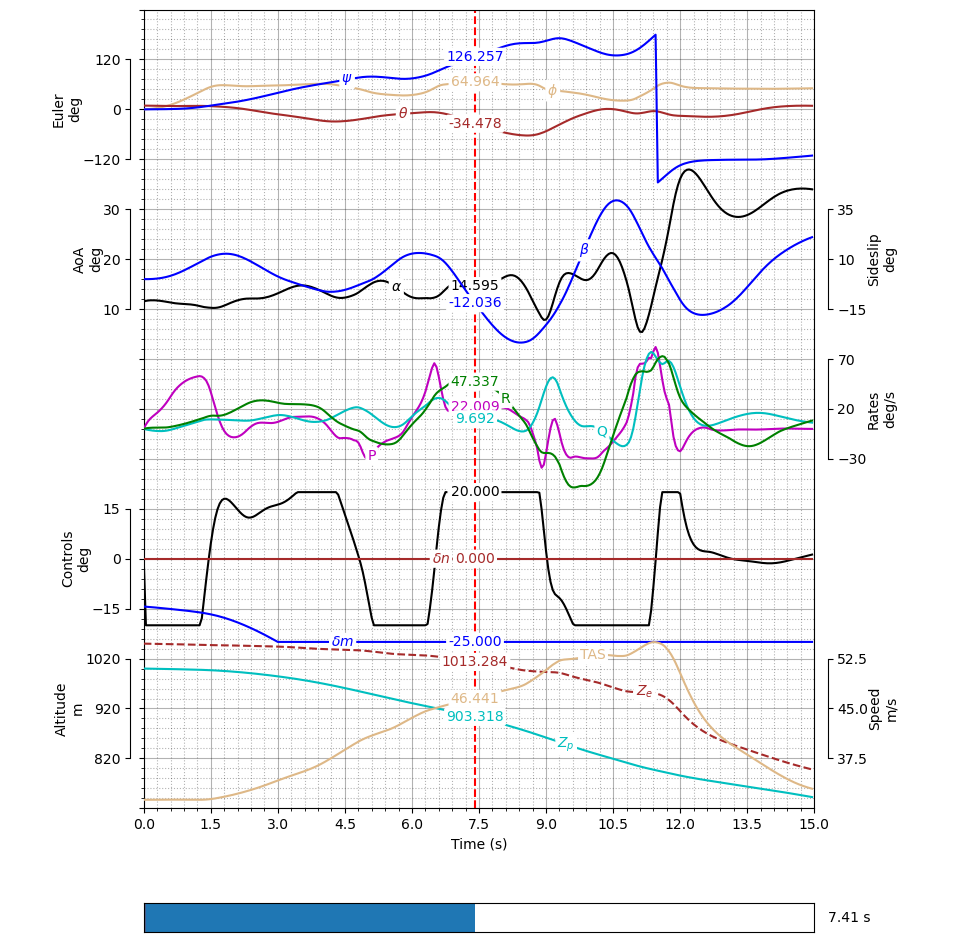

# Flight Test Plot Lib: Aircraft Flight Test and Simulation Visualization Tool

`FTPlotlib` is a Python-based visualization utility designed for plotting multi-axis time series data, specifically developed for visualizing aircraft flight and simulation test results in compact, a flight-data-recorder-like format. It is interactive, customizable, and includes slider-enabled data inspection tools. The tool comprises a 'wrapper' class for matplotlib, and thus allows for using all 'native' 2D methods and objects of the latter, providing practically unlimited customization possibilities.



## Features

- 📊 **Multi-Axis Support**: Stack multiple overlapping Y-axes on the same time grid.
- 🎯 **Interactive Time Slider**: Interactively inspect values at a specific time using a slider.
- 🔍 **Auto-Scaling**: Automatically scale added axes to match the plotted data range.
- 🧰 **Flexible Configuration**: Define grid positions, axis limits, units, and styling.
- ✨ **Annotated Curves**: Labels and dynamic value boxes display curve values at selected slider positions.

## Demo

Uncomment the last section of the script to see a live demo of the `FDRplot` class:

```python
plt.close('all')
fig, ax = plt.subplots()

Fdr = FTPlot(fig, ax, slider=True)

Fdr.AddAxis(Name='Axis 1', GridHeight=6, GridPos=0.5, Unit='m/s')
Fdr.AddAxis(Name='Axis 2', GridPos=3, Unit='m/s', Position='Right')
Fdr.AddAxis(Name='Axis 3', GridPos=5, Unit='deg', offset=0.1)

Xdata = np.linspace(0, 1)
Ydata = 3.7 * np.cos(13 * Xdata)

Fdr.AddCurve('C1', 'Axis 1', Xdata, Ydata)
Fdr.AddCurve('C2', 'Axis 2', Xdata, Ydata, color='r')
Fdr.AddCurve('C3', 'Axis 3', Xdata, Ydata, color='m')
plt.show()
```

## Installation

Make sure you have the required Python libraries installed:

```bash
pip install matplotlib numpy
```

Then, clone this repository:

```bash
git clone https://github.com/yourusername/FTPlotlib.git
cd FTPlotlib
```

Run an example script:

```bash
python -m test.TestPlotUtilities
cd FTPlotlib
```

## Usage

Import the `FTPlotlib` class in your Python script:

```python
from FTPlotlib import FTPlot
```

Initialize with a Matplotlib figure and axes, and start adding axes and curves.

## Class Overview

### `FTPlot(fig, ax, ...)`
Constructor with customizable options for grid, slider, and axis units.

### `.AddAxis(Name, GridHeight, GridPos, Unit, Position='Left', YLims='Auto', offset=0.02)`
Adds a new axis to the figure.

### `.AddCurve(Name, Axis, Xdata, Ydata, **kwargs)`
Adds a labeled curve to a specified axis.

### `.update(val)`
Used internally to update the vertical line and value boxes when the slider moves.

## Author

Created by [aantonak](https://github.com/yourusername) & [dglenis](https://github.com/dimitris-glenis) – May 2025

## License

This project is licensed under the MIT License. See the [LICENSE](LICENSE) file for details.
